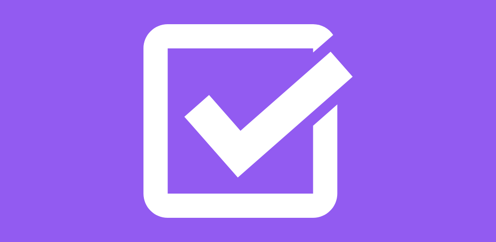

# Another To-Do List

This is my Simple To-Do list app project using some Android Jetpack features. Simple, light, beautiful and free. Another To-Do List is easy to use, ideal for adding your daily tasks and organizing your appointments. This app contains:

- Security regarding task information,
- Statistical data of active and completed tasks, and,
- Dark Theme

[Download]() for free and enjoy. :)

## Project structure

For this project we used the MVVM (Model-View-ViewModel) design pattern, where for each View there is a corresponding ViewModel that communicates with the Model layer, thus isolating the View and Model layers and establishing a clear separation of responsibilities.

## Used dependencies

- [Android navigation](https://developer.android.com/guide/navigation/navigation-getting-started)
- [Room persistence](https://developer.android.com/topic/libraries/architecture/room)
- [Koin](https://insert-koin.io)
- [LiveData](https://developer.android.com/topic/libraries/architecture/livedata)
